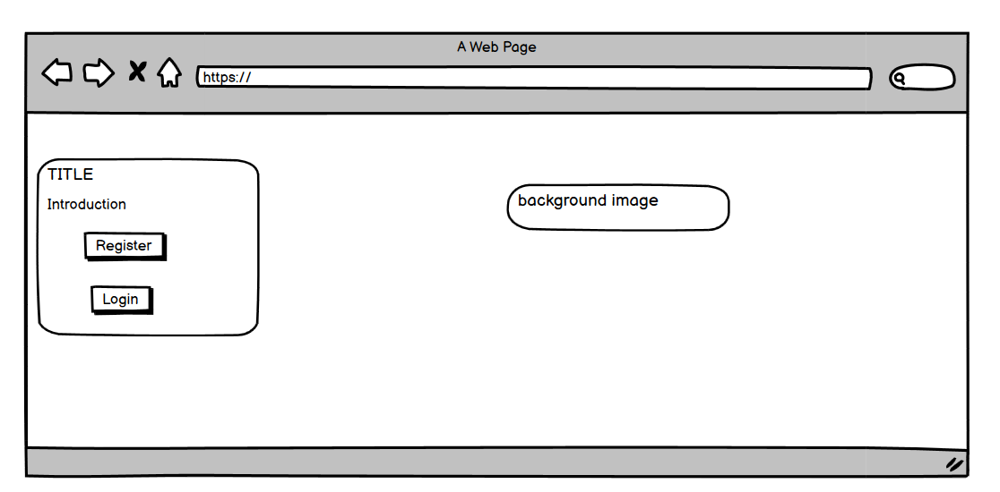
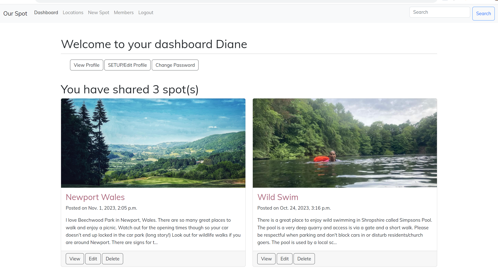
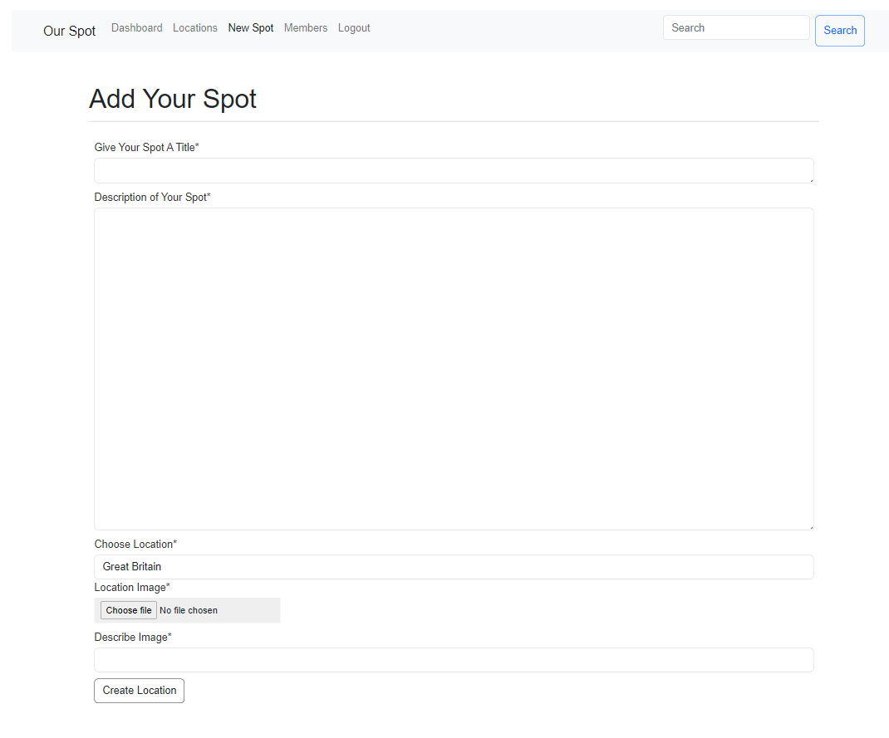

# Our Spot Social Network

## Table of Content

[Project Purpose](#project-purpose)

[Project Objectives and Outcomes](#project-objectives-and-outcomes)

[Model Views Template (mvt)](#model-views-template-mvt)

+ [Agile Terminologies](#agile-terminologies)

+ [Target Audience](#target-audience)

[User features and design](#user-features-and-design)

[Epics and user stories](#epics-and-user-stories)

[Site Structure](#site-structure)

+ [Site Colours and Font](#site-colours-and-font)

[Database Structure](#database-structure)

[Placeholders and future updates](#placeholders-and-future-updates)

[Testing](#testing)

[Deployment](#deployment)

[Technologies used](#technologies-used)

[Acknowledgements](#acknowledgements)

## Overview
Our Spot is a mobile-first developed social network created for people who love to share photos of their favourite spots around the world. Currently the site being presented is a ***minimum viable product (mvp)*** - ***Phase One*** of Two phases. It is not the final network but includes enough functionality and business logic to meet the CI project 4 purpose.

The fully deployed project can be [accessed here.](
https://ourspot-d2a3c52401dc.herokuapp.com/)
Use Ctrl (or Cmd) + click to open in new window

## Project Purpose:

This project has been built to fit into the Code Institute project 4 criteria, the aim of which is to _build a Full-Stack web application that controls a centrally-owned dataset. An authentication mechanism should be used to provide role-based access to the site's data or other activities._

This is the first working prototype of the final project and I will complete this social network once my course has finished. The project includes placeholders in some areas, but all aspects of the project criteria have been covered including implementing a data model, application features and business logic to manage, query and manipulate data

## Project Objectives and Outcomes

Our Spot is a web application made using Django. It's main aim is to provide a space where people can go to share their favourite places around the world. Places they go to for fun with friends/loved ones or for peace and space away from the world. By sharing individually we collectively build a resource of wonderful spaces to enjoy at a local and global level. As well as sharing photos, the site will also provide an opportunity to connect with other members and foster friendships.

The key objectives of the project include:

- Providing a user-centric experience that encourages sharing and interaction through an intuitive easy to use interface.

- Offering a dedicated space for anyone looking to contribute photos of their favourite spot including local parks, open spaces and hangouts, with an opportunity to share what there is to do and why they love it.

- An opportunity for people to engage and interact with each other through comments, fostering connecting and opening dialogue. Profiles are provided for each member.

- Building a database-backed model-view-template (MVT) web application that lets users store and manipulate data records including the ability to create, edit and delete.

- Giving users the ability to initiate and control their actions while providing immediate and complete feedback on data.processes.

- A place where administrators of the project have a panel that allows them to monitor users and the information they share as well as the comments they make, to ensure the community is kept safe and the environment is not abused.

The end result has been a user-friendly photo sharing network that has been encouraged and informed through user engagement.

## Model Views Template (MVT)

I used MVT to help define the project's requirements, features, and structure by considering the following questions

**Model :**

- What data do we need to store in the database for this network? E.g. username, password, photo etc
- What are the attributes of a User profile for the members?
- What information should be associated with a location (or spot) shared by users.
- What profile is needed to represent users and their attributes?

**View :**

- What should users see when they first visit the website (homepage)?
- How do we display the latest locations shared by all users and by the user alone.
- What views or pages are needed for users to register and log in?
- How should the process to add new locations be structured in terms of user interactions and views?
- What information should be displayed on a users profile page?

**Template :**

- What should the HTML structure of the site look like? What is the layout for the pages?
- What should the structure and design of the user registration and login forms look like?
- What does the users template to add, edit and delete locations look like? How should they be structured?
- What should these templates include?
- What should the format and style of a users profile page look like?

**Authorization :**

- How will users authentication and authorization be handled to ensure that only authorised users can add photos?
- Do we need to integrate any third-party services for features like email notifications?
- How will errors and validation on user input be handled?
- What testing strategies will be employed to ensure the system functions correctly?
- How will user acceptance testing (UAT) be handled?

These questions lay the groundwork for creating user stories, developing the database schema, designing templates, and implementing the necessary views and functionality within Django.

## Agile Terminologies

- Create backlog

- Divide work into sprints

- Create subset sprints

- Review work - completed yesterday, to do today, any challenges

- Testing - developer tool, (print) command, keep an eye on terminal/console area.

- Obtain feedback.

- Maintain product backlog and prioritise items/adapt to change

Future implementations/scalability and performance optimisation.

## Target Audience

The Our Spot social network has been designed for:

Nature lovers who enjoy being outside and who appreciate the health benefits of spending time in nature.

People looking to share the places they love to visit as well as people looking for places to visit, whether that is for something to do on a romantic date or a place to go to enjoy solitude.

Photographers and travellers who love to share some of their favourite spots around the world.

## User Features and Design

As a member of the network users will enjoy:

- A network that focuses on the importance of spending time outside

- The opportunity for users to share their experiences and activities through photographs

- An opportunity to interact with other members through comments and the follow system

- A user-friendly dashboard that provides access to all parts of the network easily

- A user-friendly system/user journey for adding, commenting on and liking photos

- A user-friendly design that works across all devices

- Simplicity in registering, using and interacting were the main priorities

This research fed into the MVT and user stories.

(<a href="#table-of-content">back to top</a>)

## EPICS and User Stories

Based on the MVT model above, the following EPICS and user stories were created to support project development.

[View my GitHub Project Board Here](https://github.com/users/todiane/projects/8/views/1?layout=board)

## EPICS:

A total of five EPICS were created to complete the first phase and organised into sprints.

**_User Authentication and Registration:_**
Covering network setup up, role allocation, user registration, login, and logout functionality.

**_User Profiles:_**
This epic covers user profiles, creating, editing and deleting

**_Photo Management:_**
How users will add, edit and delete locations.

**_Location Detail Page:_**
This focuses on the detailed view of a specific location, including comments and likes.

**_User Connections:_**
The structure for following and displaying the latest activity of followed users.

## Admin

**_Manage Accounts:_** As an administrator, I want to be able to manage user accounts, including creating, editing, and deactivating them if necessary so that my records are kept up to date.

**_Register to add photos:_**
As Admin, I want users to register before being able to book addd a new photo.

**_Password Change:_**
As a admin I want to set up a system so users can change their password when they are logged in.

**_Create, Read, Update and Delete_**
As admin I want to be able to create, read, update and delete photos, comments and profiles so that the admin area is kept up to date.

## User

**_Registration and Log-In_**
As a user, I want to be able to register an account, so I can participate in Our Spot and immediately log-in.

**_log-In/log out_**
As a user, I want to log in and out of my account so that I can access the platform securely.

**_Create, Edit, cancel and delete photos:_**
As a user I want to be able to create, edit, and delete my photos so that I can stay in control of the information I share.

**_View User Photos:_**
As a user, I want to be able to view the photos of other users and like/comment on them. 

**_View Photo Information_**
As a user, I want to view detailed information about a spot when I click on it.

**_Create, Edit, cancel and delete profile:_**
As a user I want to be able to create, edit, and delete my profile so that I have an accurate record of all my personal information and activity.

**_View User Profile:_**
As a user, I want to be able to view my profile and latest activity so that I can keep my information up to date.

**_View Other Profiles:_**
As a user I want to be able to view the profiles of other users so that I can follow their activity.

**_Search Facilities:_**
As a user I want to be able to search for different photos available based on their location.

(<a href="#table-of-content">back to top</a>)

# Site Structure

When designing the structure of the site I kept my focus on the need to create a web-based application that has both a user interface (front end) and server-side logic database (back end) stored in a central location. 

In order to log-in users must add a username and password. Email is optional in Phase One, although it helps to add an email - even a fake one - so you can login using username or email. In Phase Two when email authentication is included this will change.

As long as the minimum requirements are met users are informed of their registration success and invited to immediately login.

Once logged-in users are met with their dashboard

Other options available are to see images added by other uses and to addd their own images

Important features to include was the ability for users to interact with this interface and manipulate the data through CRUD capabilities, while providing clear updates on any changes made.

Users can update their passwords, edit and delete their locations and comments (see images below for actual screenshots)

Messages are used to ensure that any changes to the data are notified to the user.

## Site Colours and Font

The font used for the site is a Google Font called [Mulish](https://fonts.google.com/specimen/Mulish?query=muli)

  

## Database structure

The site contains a usable database that stores data in a consistent and well-organised manner. Postresql was used to create the data structure. There were a few challenges with the database which meant I had to reset it and start again. 
After the second data crash I moved over to GitPod.

# Image of database 

(<a href="#table-of-content">back to top</a>)

## CRUD functionality

The ability to create, read, update and delete data has been added. The site provides role-based access to admin who are superusers and have full access to all data and users who are limited to access made available by admin.

Users are able to manipulate the data model using the following:

**_Members:_**

A dashboard where members can view a list of their latest uploads as well as gain access to view, edit and delete them.

A page dedicated to creating new uploads with a simple interface.

  

Pages where users can edit/change their information

  
  

The ability to like the photos of other members and add a comment.
  

The ability to edit and delete comments.

  
  

**_Admin:_**

A central location where the site can be managed including the ability to create, read, edit and delete:

- members
- locations/photos added by members
- profiles
- comments

(<a href="#table-of-content">back to top</a>)

## Authentication and Authorisation

Authorisation is only available to registered users so the site is hidden away and register details available on the homepage with a login link in the navigation bar. 

In Phase One, email requirement is not necessary to become a member. Only user name and password are essential items, making registration quick and easy.
Users can register using lowercase or uppercase text.

Once registered a new users is invited to log-in. If they included their name when registering it will appear with the welcome message.

New members are then taken to the dashboard area where they can update their profile and/or add a new location photo.

Once inside members who want to add information to their profile will only be able to do so if they include an email address. The Admin area has been setup to make email a requirement of members, however madeup email addresses can be used.

(<a href="#table-of-content">back to top</a>)

***Password Management***

In the first phase of this project the ability to change a members password is available inside the members area.

In the next phase the ability to use a password reset email will be included.

## Navigation

A simple navigation was created using Bootstrap Navbar. Only logged-in users can see the pages available. Unregistered and logged out users only see the ability to register and log in.

***No footer has been included*** because this is a social network and they don't usually contain a footer - instead users are kept scrolling using infinite scroll, which will be added in Phase Two.

## Dashboard

After logging in users are taken to their dashboard where they are presented with a list of their recent uploads.
They also have the ability to view and edit their profile

## Recently added

This page contains the photos of all members and infinite scroll has been used so that members can scroll down and look through the photos.

When a user clicks on a photo they are taken to a display page. If they are the owner of the photo they have the ability to edit and delete the photo. If they are not users can comment and like the photo.

## Add New Spot

This area has been kept fairly simple. Users can add a title, description (up to 500 words), photo and to ensure the alt feature is added users are encouraged to describe their photo.

  

## Edit, Delete Spot

The ability to edit or delete any photo uploaded by a user is available on their dashboard and also shows up on locations they have added.

  

Edit Location

  

Delete Location

  

## Likes and Comments

The ability to like and comment on a photo is available to all users. The ability to delete a comment has also been included

## Report profile and/or photo

There is a link available for members who want to report a profile or photo. A pop up box appears inviting them to submit their report to Admin.

Message box that appears

## List of Members

This page contains a list of profile photos with the name of the user. This can be clicked and a full profile appears.

## User Profile

Each member is provided with a profile however adding a photo is optional. When you visit a profile you will see any locations that have been added by that user.

  
  

(<a href="#table-of-content">back to top</a>)

## Placeholders and Future Updates

The network includes a few placeholders that were adding so show additional features that will be included. These are:

_Report a photo or profile_ - The button under photos and profiles can be clicked to report a photo/profile to Admin. This currently works on the network but is not connected to an email system.

_Email password_ - If a member is unable to log-in because they have forgotten their password the ability to complete the "forgotten password" form is available but is not currently a working system.

As a social network there were a number of features that will be added at a later date. Future features include:

- Email authentication - the ability to sign up using email to verify your account and receive notifications via email.

- The ability to search for images based on tags.

- Album creation so photos can be saved into specific albums, e.g. parks, holiday etc.

- Personalised recommendations - users receive recommendations for new spots based on previous uploads.

- A feed that shows user activity and trending images.

- The ability to follow members and get updated when they post.

(<a href="#table-of-content">back to top</a>)

## Testing

Please see my separate [Testing MD page HERE](/TESTING.md) that includes information on testing, viability and bugs.

## Deployment

Deployment took place immediately after installing Django.

***Deploy To Heroku***

First create A Pipfile in your project terminal.

In the terminal enter the command  pip3 freeze > requirements.txt, and a file with all requirements will be created.

***Setting up Heroku***

- Go to the Heroku website (https://www.heroku.com/)
- Login to Heroku and choose Create App.
- Click New and Create a new app.
- Choose a name and select your location.
- Navigate to the Deploy tab.
- Click on Connect to Github and search for your repository.
- Navigate to the Settings tab.
- Reveal Config Vars and add your Cloudinary, Database URL (from ElephantSQL) and Secret key, plus PORT 8000.

***Deployment on Heroku***

- Go to the Deploy tab.

- For the very first deployment select manual deploy and wait as Heroku builds the logs. Once complete click on the button to view the app.

- After the initial deployment you can then enable automatic deployment.

***Fork the repository***

For creating a copy of the repository on your account and change it without affecting the original project, useFork directly from GitHub:

On [My Repository Page](https://github.com/todiane/our-spot), press Fork in the top right of the page.
A forked version of my project will appear in your repository.

***Clone the repository***

For creating a clone of the repository on your local machine, useClone:

On [My Repository Page](https://github.com/todiane/our-spot), click the Code green button, right above the code window
Chose from HTTPS, SSH and GitClub CLI format and copy (preferably HTTPS)
In your IDE open Git Bash
Enter the command git clone followed by the copied URL
Your clone was created

(<a href="#table-of-content">back to top</a>)

## Technologies Used

**_Core Resources:_**

- [Django](https://www.djangoproject.com/) - Framework
- [Python](https://python.org)
- HTML5 and CSS
- [Bootstrap 5](https://getbootstrap.com/docs/5.0/getting-started/introduction/) - predefined responsive styles and NavBar
- [GitHub](https://github.com/)
- [GitHub projects](https://github.com/users/todiane/projects/8/views/1?layout=board) - managing and monitoring progress
- JavaScript & JQuery
- Postgresql (via ElephantSQL)

**_Project Resources_**

- [ElephantSQL](https://www.elephantsql.com/)
- [Heroku](https://heroku.com)
- [Cloudinary](https://cloudinary.com)
- [CodeAnywhere](https://codeanywhere.com)
- [GitPod](https://gitpod.com)
- [Visual Studio Code](https://code.visualstudio.com/)
- [Google Developer Tools](https://developer.chrome.com/docs/devtools/)

**_Additional Resources_**

- Images - Although member profile names and photos are made up and not real many of the images have been supplied by potential members. I have also supplied my own images and additional images were sourced via Pexel.com
- [Favicon Generator](https://realfavicongenerator.net/)
- [Canva](https://www.canva.com/en_gb/)
- [PNG to WEBP converter](https://www.freeconvert.com/png-to-webp) - Changing images to webp
- [Balsamiq](https://balsamiq.com/) for wireframes
- [Diffchecker to check code](https://www.diffchecker.com/text-compare/ )

## Resources Used

Use Ctrl (or Cmd) + click to open in new window

- [Django 4 by Example book - for initial idea](https://www.packtpub.com/product/django-4-by-example-fourth-edition/)

- [Daisy Mc YouTube - CRUD functionality](https://www.youtube.com/watch?v=sBjbty691eI&list=PLXuTq6OsqZjbCSfiLNb2f1FOs8viArjWy)

- [Tomi/Free Code Camp - Build a social media app](https://www.youtube.com/watch?v=xSUm6iMtREA&t=13188s)

- [Slackoverflow forum](https://stackoverflow.com/questions/2315187/allowing-users-to-delete-their-own-comments-in-django) for answers when stuck.

- [Django Packages](https://djangopackages.org/)

(<a href="#table-of-content">back to top</a>)

## Acknowledgements

- Users who answered questions, provided images and tested the site by registering and adding images.

- Forum over at [DjangoProject](https://forum.djangoproject.com/) - especially Ken

- Daisy who's [YouTube videos](https://www.youtube.com/watch?v=sBjbty691eI&list=PLXuTq6OsqZjbCSfiLNb2f1FOs8viArjWy) helped me create the CRUD functionality of this site and who also helped me personally.

- Slack community and Tutor support.
