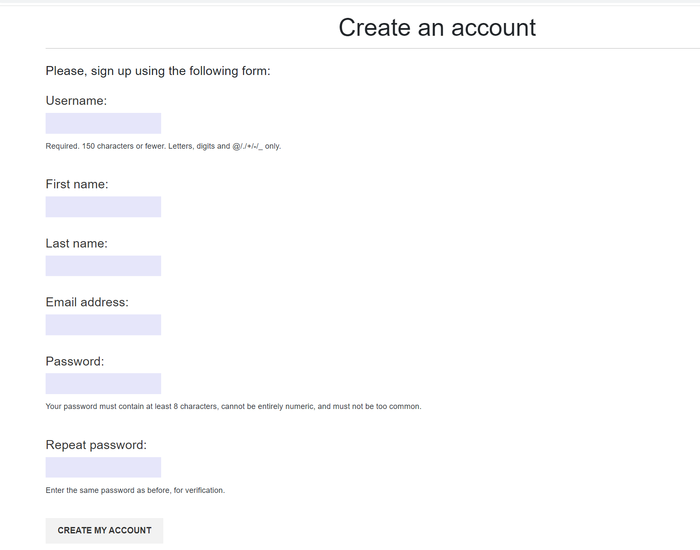
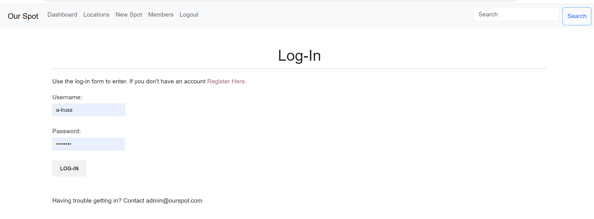
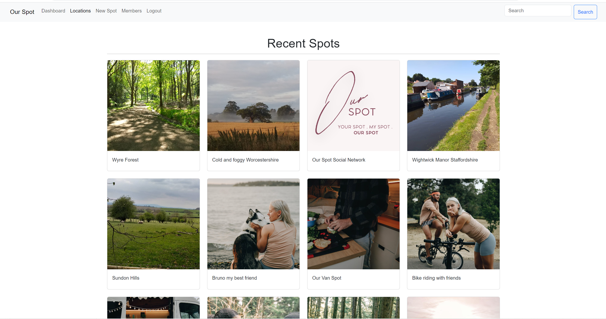
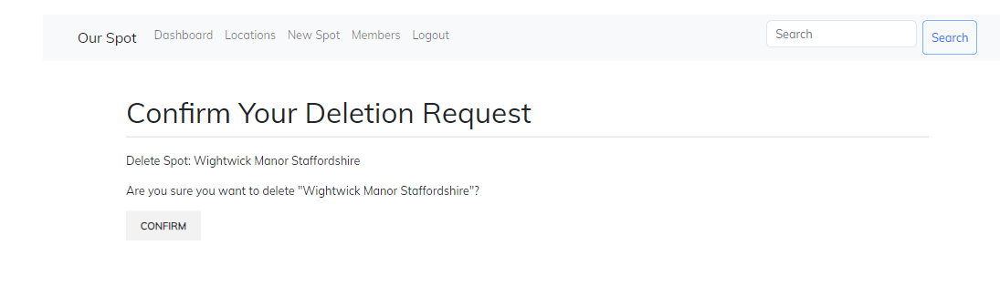
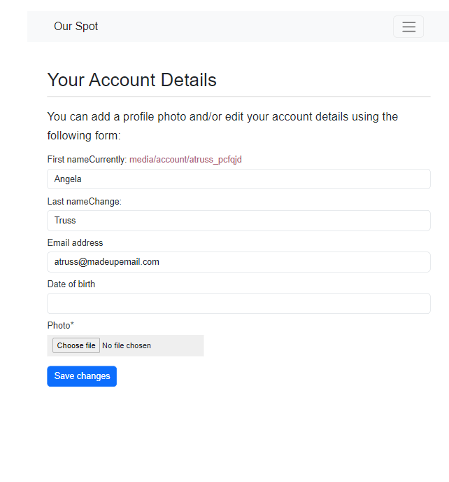

# Our Spot Social Network


## Table of Content

[Overview](#overview)

+ [Project Purpose](#project-purpose)

+ [Project Objectives and Outcomes](#project-objectives-and-outcomes)

+ [Target Audience](#target-audience)

[Model Views Template (mvt)](#model-views-template-mvt)

+ [Agile Terminologies](#agile-terminologies)

[Database Structure](#database-structure)

[Site Structure](#site-structure)

+ [User features and design](#user-features-and-design)

+ [Epics and user stories](#epics-and-user-stories)
    + [Epics](#epics)
    + [Admin](#admin)
    + [User](#user)

+ [Authentication and Authorisation](#authentication-and-authorisation)

+ [Navigation](#navigation)

+ [Dashboard](#dashboard)

+ [Recently Added](#recently-added)

+ [Add New Spot](#add-new-spot)

+ [Edit and Delete Spot](#edit-and-delete-spot)

+ [Likes and Comments](#likes-and-comments)

+ [Report Profile and Photo](#report-profile-and-photo)

+ [List of Members](#list-of-members)

+ [User Profiles](#user-profile)

+ [Site Colours and Font](#site-colours-and-font)

[CRUD Functionality](#crud-functionality)

[Placeholders and future updates](#placeholders-and-future-updates)

[Testing](#testing)

[Deployment](#deployment)

[Technologies Used](#technologies-used)

[Resources Used](#resources-used)

[Acknowledgements](#acknowledgements)

[Retrospective](#retrospective)


## Overview

Our Spot is a mobile-first developed social network created for people who love to share photos of their favourite spots around the world. Currently the site being presented is a ***minimum viable product (mvp)*** - ***Phase One*** of Two phases. It is not the final network but includes enough functionality and business logic to meet the CI project 4 purpose.

The fully deployed project can be [accessed here.](
https://ourspot-d2a3c52401dc.herokuapp.com/)
Use Ctrl (or Cmd) + click to open in new window

## Project Purpose:

<details>

This project has been built to fit into the Code Institute project 4 criteria, the aim of which is to _build a Full-Stack web application that controls a centrally-owned dataset. An authentication mechanism should be used to provide role-based access to the site's data or other activities._

This is the first working prototype of the final project and I will complete this social network once my course has finished. The project includes placeholders in some areas, but all aspects of the project criteria have been covered including implementing a data model, application features and business logic to manage, query and manipulate data.

_When talking about access for superusers and members the term users will be used, otherwise the term members will be used. Of course some superusers are also members!_


</details>

## Project Objectives and Outcomes

<details>

Our Spot is a web application made using Django. It's main aim is to provide a space where people can go to share their favourite places around the world. Places they go to for fun with friends/loved ones or for peace and space away from the world. 

By sharing individually we collectively build a resource of wonderful spaces to enjoy at a local and global level. As well as sharing photos, the site will also provide an opportunity to connect with other members and foster friendships.

The key objectives of the project include:

- Providing a user-centric experience that encourages sharing and interaction through an intuitive easy to use interface.

- Offering a dedicated space for anyone looking to contribute photos of their favourite spot including local parks, open spaces and hangouts, with an opportunity to share what there is to do and why they love it.

- An opportunity for people to engage and interact with each other through comments, fostering connecting and opening dialogue. Profiles are provided for each member.

- Building a database-backed model-view-template (MVT) web application that lets users store and manipulate data records including the ability to create, edit and delete.

- Giving users the ability to initiate and control their actions while providing immediate and complete feedback on data.processes.

- A place where administrators of the project have a panel that allows them to monitor users and the information they share as well as the comments they make, to ensure the community is kept safe and the environment is not abused.

The end result has been a user-friendly photo sharing network that has been encouraged and informed through user engagement.

</details>

## Target Audience

<details>

The Our Spot social network has been designed for:

| Enthusiastic  | People |
| ------------- | ------------- |
| Nature lovers who enjoy being outside and who appreciate the health benefits of spending time in nature.  | Photographers and travellers who love to share some of their favourite spots around the world.  |
| Adults looking to share the places they love to visit. | Adults looking for places to visit with friends/family or alone.  |

The network is for adults looking to share and find places to go for something to do on a romantic date or a place to go to enjoy solitude.


</details>

## Model Views Template (MVT)

<details>

I used MVT to help define the project's requirements, features, and structure by considering the following questions

**Model :**

- What data do we need to store in the database for this network? E.g. username, password, photo etc
- What are the attributes of a User profile for the members?
- What information should be associated with a location (or spot) shared by members.
- What profile is needed to represent members and their attributes?

**View :**

- What should members and non-members see when they first visit the website (homepage)?
- How do we display the latest locations shared by all members and by an individual member.
- What views or pages are needed for members to register and log in?
- How should the process to add new locations be structured in terms of member interactions and views?
- What information should be displayed on a members profile page?

**Template :**

- What should the HTML structure of the site look like? What is the layout for the pages?
- What should the structure and design of the member registration and login forms look like?
- What does the users template to add, edit and delete locations look like? How should they be structured?
- What should these templates include?
- What should the format and style of a users profile page look like?

**Authorization :**

- How will users authentication and authorization be handled to ensure that only authorised users can add photos?
- Do we need to integrate any third-party services for features like email notifications?
- How will errors and validation on user input be handled?
- What testing strategies will be employed to ensure the system functions correctly?
- How will user acceptance testing (UAT) be handled?

These questions lay the groundwork for creating user stories, developing the database schema, designing templates, and implementing the necessary views and functionality within Django.

</details>

## Agile Terminologies

<details>

My aim throughout this project was to focus my working time using agile terminologies:

- Create backlog
- Divide work into sprints
- Create subset sprints
- Review work - completed yesterday, to do today, any challenges
- Testing - developer tool, (print) command, keep an eye on terminal/console area.
- Obtain feedback.
- Maintain product backlog and prioritise items/adapt to change
- Future implementations/scalability and performance optimisation.

</details>


## Database structure

<details>

The site contains a usable database that stores data in a consistent and well-organised manner. Postresql was used to create the data structure which is hosted at ElephantSQL. 

This database schema defines the structure and relationships for this application. I used business logic in the design of the database by ensuring there are clear relationships between each model - e.g. User, Locations, Comment, Like, user profile. There is a method to count likes, to add users, to allow users to edit and update their profile etc.

Once users register a file is created that stores their username and password plus any additional information provided. Users are then allocated a profile and have the ability to upload photos based on a location. These locations can be liked and commented upon by other users.

Below is the entity relationship diagram for Our Spot.

<br><br>

***User*** includes username, first and last name, email and password. The username is a one-to-one field, while the other fields are textFields.

***User profile*** extends the details provided in the user section and also includes a date of birth dateField and a photo imageField.

***Locations*** includes a charField title, slugField slug for the url, a charfield for description & image alt, cloudinary for image and a tuple for the location types. The posted date uses the datetime field.

***Like***. A foreign key is used for a user to like a location and for the location itself.

***Comment***. as the user is already logged-in, only the comment box text field is needed along with a datetime field for created and updated. The user and location are both foreign keys.

</details>

<p align="right">(<a href="#table-of-content">back to top</a>)</p>

## Site Structure

<details>

When designing the structure of the site I kept my focus on the need to create a mobile first web-based application that has both a user interface (front end) and server-side logic database (back end) stored in a central location. 


In order to log-in users must add a username and password. Email is optional in Phase One, although it helps to add an email - even a fake one - so you can login using username or email. In Phase Two when email authentication is included this will change.


As long as the minimum requirements are met users are informed of their registration success and invited to immediately login.

Once logged-in users are met with their dashboard


Other options available are to see images added by other uses (locations tab) and to addd their own images (new spot tab).


Important features to include was the ability for users to interact with this interface and manipulate the data through CRUD capabilities, while providing clear updates on any changes made.


Users can update their passwords, edit and delete their locations and comments (see images below for actual screenshots)

Messages are used to ensure that any changes to the data are notified to the user.


</details>

## User Features and Design

<details>

As a member of the network users will enjoy:

- A network that focuses on the importance of spending time outside

- The opportunity for users to share their experiences and activities through photographs

- An opportunity to interact with other members through comments and the follow system

- A user-friendly dashboard that provides access to all parts of the network easily

- A user-friendly system/user journey for adding, commenting on and liking photos

- A user-friendly design that works across all devices

- Simplicity in registering, using and interacting were the main priorities

This research fed into the MVT and user stories.

</details>

<p align="right">(<a href="#table-of-content">back to top</a>)</p>

## EPICS and User Stories

<details>

Based on the MVT model above, the following EPICS and user stories were created to support project development.

[View my GitHub Project Board Here](https://github.com/users/todiane/projects/8/views/1?layout=board)

</details>

### Epics:

<details>

A total of five EPICS were created to complete the first phase and organised into sprints. 

**_User Authentication and Registration:_**
Covering network setup up, role allocation, user registration, login, and logout functionality.

**_User Profiles:_**
This epic covers user profiles, creating, editing and deleting

**_Photo Management:_**
How users will add, edit and delete locations.

**_Location Detail Page:_**
This focuses on the detailed view of a specific location and what will be shown.

**_User Connections:_**
The structure for liking locations and adding, editing and deleting comments.

</details>

### Admin

<details>

**_Manage Accounts:_** As an administrator, I want to be able to manage user accounts, including creating, editing, and deactivating them if necessary so that my records are kept up to date.

**_Register to add photos:_**
As Admin, I want users to register before being able to look at or add a new photo.

**_Password Change:_**
As a admin I want to set up a system so users can change their password when they are logged in.

**_Create, Read, Update and Delete_**
As admin I want to be able to create, read, update and delete photos, comments and profiles so that the admin area is kept up to date.

</details>

### User

<details>

**_Registration and Log-In_**
As a user, I want to be able to register an account, so I can participate in Our Spot and immediately log-in.

**_log-In/Log Out_**
As a user, I want to log in and out of my account so that I can access the platform securely.

**_Create, Edit, Cancel and Delete Photos:_**
As a user I want to be able to create, edit, and delete my photos so that I can stay in control of the information I share.

**_View User Photos:_**
As a user, I want to be able to view the photos of other users and like/comment on them. 

**_View Photo Information_**
As a user, I want to view detailed information about a spot when I click on it.

**_Create, Edit, cancel and delete profile:_**
As a user I want to be able to create, edit, and delete my profile so that I have an accurate record of all my personal information and activity.

**_View User Profile:_**
As a user, I want to be able to view my profile and latest activity so that I can keep my information up to date.

**_View Other Profiles:_**
As a user I want to be able to view the profiles of other users so that I can follow their activity.

**_Search Facilities:_**
As a user I want to be able to search for different photos available based on their location.

</details>

<p align="right">(<a href="#table-of-content">back to top</a>)</p>


## Authentication and Authorisation

<details>

Authorisation is only available to registered users so the site is hidden away and register details available on the homepage with a login link in the navigation bar. 


In Phase One, email requirement is not necessary to become a member. Only user name and password are essential items, making registration quick and easy.

Business logic was used in the creation of the registation and log-in forms by ensuring that incoming data is validated against my business rules. e.g. users can create usernames using lowercase or uppercase text, they can log in with an email address or user name, an email address can only be used once to create an account etc

<br><br>

If a new user tries to register using an email address already in the system an error message will appear.

<br><br>

Once registered a new user is invited to log-in. 
If they included their name when registering it will appear with the welcome message.

<br><br>

<br><br>

Users can log-in using an email address or username. 

<br><br>

New members are then taken to the dashboard area where they can update their profile and/or add a new location photo.

<br><br>

The dashboard area will show a first name if one was provided during the registration process (image above), otherwise it will be left blank.

<br><br>

Once inside users who want to add information to their profile will only be able to do so if they include an email address. The Admin area has been setup to make email a requirement of members, however madeup email addresses can be used as authentication via email will not take place until Stage Two.

<br><br>


<p align="right">(<a href="#table-of-content">back to top</a>)</p>

***Password Management***

In the first phase of this project the ability to change a users password is available inside the members area.

<br><br>

In the next phase the ability to use a password reset email will be included.

</details>

## Navigation

<details>

A simple navigation was created using Bootstrap Navbar. Only logged-in users can see the pages available. Unregistered and logged out users only see the ability to register and log in.


***No footer has been included*** because this is a social network and they don't usually contain a footer - instead users are kept scrolling using infinite scroll, which will be added in Phase Two.

</details>

## Dashboard

<details>

After logging in users are taken to their dashboard where they are presented with a list of their recent uploads.
They also have the ability to view and edit their profile


</details>

<p align="right">(<a href="#table-of-content">back to top</a>)</p>

## Recently added

<details>

This page contains the photos of all users added to the site. Users can click on the photo to view it.



When a user clicks on a photo they are taken to a display page. If they are the owner of the photo they have the ability to edit and delete the photo. If they are not users can comment and like the photo.

<br>


</details>

## Add New Spot

<details>

This area has been kept fairly simple. Users can add a title, description (up to 500 words), photo and to ensure the alt feature is added users are encouraged to describe their photo.

<br>

</details>

## Edit and Delete Spot

<details>

The ability to edit or delete any photo uploaded by a user is available on their dashboard and also shows up on locations they have added.

<br>

Edit Location

<br>

Delete Location

<br>


</details>

<p align="right">(<a href="#table-of-content">back to top</a>)</p>

## Likes and Comments

<details>

The ability to like and comment on a photo is available to all users. The ability to delete a comment has also been included


There is a link back to the profile of any user who leaves a comment (see [user profile](#user-profile) information below for image)

</details>

## Report profile and photo

<details>

There is a link available for users who want to report a profile or photo. A pop up box appears inviting them to submit their report to Admin.


Message box that appears - this is currently a [placeholder](#placeholders-and-future-updates) only function


</details>

## List of Members

<details>

This page contains a list of profile photos with the name of the user. This can be clicked and a full profile appears.


</details>


## User Profile

<details>

Each user is provided with a profile however adding a photo is optional. When you visit a profile you will see any locations that have been added by that user.

<br><br>
<br><br>

The user profile is linked to any location they add or comment they make so users can click the link to visit their profile

<br><br>

<br><br>


While members can edit their profile they cannot delete it. There is a message shown that let's them know they can contact admin to delete their account.

<br><br>

</details>

<p align="right">(<a href="#table-of-content">back to top</a>)</p>


## Site Colours and Font

<details>

The font used for the site is a Google Font called [Mulish](https://fonts.google.com/specimen/Mulish?query=muli)

<br><br>

</details>


<p align="right">(<a href="#table-of-content">back to top</a>)</p>


## CRUD functionality

<details>

The ability to create, read, update and delete data has been added. The site provides role-based access to admin who are superusers and have full access to all data and members who are limited to access made available by admin. 

_REMINDER: When talking about access for superusers and members the term users will be used otherwise the term members is used. Of course some superusers are also members!_

Users are able to manipulate the data model using the following:

**_Members:_**

A dashboard where members can view a list of their latest uploads as well as gain access to view, edit and delete them.


A page dedicated to creating new uploads with a simple interface. Users can add their description and photo as well as selecting the region of their location. When using the search function users are then able to search by country.

<br><br>

Pages where users can edit/change their information


<br><br>
<br><br>

The members ability to delete and close their account has not been included in phase one. However, a message is shown to inform them that they can contact Admin if they want their details removed.

The ability to like the photos of other users and add a comment.
<br><br>

The ability to edit and delete comments.

<br><br>
<br><br>


**_Admin:_**

A central location where the site can be managed including the ability to create, read, edit and delete:

- members
- locations/photos added by members
- profiles
- comments


</details>

<p align="right">(<a href="#table-of-content">back to top</a>)</p>


## Placeholders and Future Updates

<details>

Included in the [Github Project Board](https://github.com/users/todiane/projects/8/views/1?layout=board) are user stories under the column "Stage Two" which represents upcoming iterations. This backlog includes user stories created for an upcoming development phase. 

This phase provides an opportunity for me to respond to member feedback. It also allows for ongoing refinements and improvements that will evolve based on user input and needs. This highlights the adatability and scalability of the project.

This means that the network includes a few placeholders that were adding to highlight some of these additional features to be included in Stage Two. These are:
<br>

_Report a photo or profile_ - The button under photos and profiles can be clicked to report a photo/profile to Admin. This currently works on the network but is not connected to an email system.

_Email password_ - If a member is unable to log-in because they have forgotten their password the ability to complete the "forgotten password" form is available but is not currently a working system.

As a social network there were a number of features that will be added at a later date. Future features include:

- Email authentication - the ability to sign up using email to verify your account and receive notifications via email.

- The ability to search for images based on tags.

- Album creation so photos can be saved into specific albums, e.g. parks, holiday etc.

- Personalised recommendations - members receive recommendations for new spots based on previous uploads.

- A feed that shows member activity and trending images.

- The ability to follow members and get updated when they post.

</details>

<p align="right">(<a href="#table-of-content">back to top</a>)</p>

## Testing

Please see my separate [Testing MD page HERE](/TESTING.md) that includes information on testing, viability and bugs.

## Deployment

<details>

Deployment took place immediately after installing Django.
<br>


#### Installing libraries

The following steps outline all libraries needed for successful deployment on Heroku. All neccessary-requirements and settings updates will not be discussed in this section as they are assumed as logical follow-up steps to installments. For a full explanation of how to install these libraries, refer to the links provided in [Technologies Used](#technologies-used).

- Install **Gunicorn** (server used to run Django on Heroku): ``pip3 install django gunicorn``
- Install **pyscopg2** (connects to PostgreSQL): ``pip 3 install dj_database_url pyscopg2``
- Install **Cloudinary** (host static files and images): ``pip3 install dj3-Cloudinary-storage``


#### Create a PostgreSQL database using ElephantSQL

This is necessary to create a database that can be accessed by Heroku. The database provided by Django can not be accessed by the deployed Heroku app.

- Log into ElephantSQL and go to Dashboard
- Click **Create New Instance**
- Set up a plan by providing a Name (project name) and select a Plan (for this project the free plan "Tiny Turtle" was chosen). Tags are optional.
- Click **Select Region** and choose appropriate Datacenter
- Click **Review**, check all details and click **Create Instance**
- Return to Dashboard on click on the name of the newly created instance
- Copy the database URL from the details section

#### Hiding sensitive information

- Create ``env.py`` file and ensure it is included in the ``.gitignore`` file
- Add ``import os`` to env.py file and set environment variable **DATABASE_URL** to the URL copied from ElephantSQL (``os.environ["DATABASE_URL"]="<copiedURL>"``)
- Below, set **SECRET_KEY** variable (``os.environ["SECRET_KEY"]="mysecretkey"``, but create a more secure password.)


#### Update Settings

- Add the following code at the top of ``settings.py`` to connect the Django project to env.py:
    ````
      import os
      import dj_database_url
      if os.path.isfile('env.py'):
          import env
    ````
- Remove the insecure secret key provided by Django in settings.py and refer to a variable in env.py instead (``SECRET_KEY = os.environ.get('SECRET_KEY')``)

- To connect to the new database, replace the provided **DATABASE** variable with 
    ````
    DATABASES = {
    'default': dj_database_url.parse(os.environ.get("DATABASE_URL"))
    }
    ````
- Save and migrate all changes made


#### Connect to Cloudinary

- In the Cloudinary dashboard, copy **API Environment variable**
- In ``env.py`` file, add new variable ``os.environ["CLOUDINARY_URL"] = "<copied_variable"`` and remove ``CLOUDINARY_URL=`` from the variable string
- Add same variable value as new Heroku config var named **CLOUDINARY_URL**
- In ``settings.py``, in ``INSTALLED_APPS`` list, above ``django.contrib.staticfiles`` add ``cloudinary_storage``, below add ``cloudinary``
- To define Cloudinary as static file storage add the following to settings.py
    ````
    STATICFILES_STORAGE = 'cloudinary_storage.storage.StaticHashedCloudinaryStorage'

    DEFAULT_FILE_STORAGE = 'cloudinary_storage.storage.MediaCloudinaryStorage'
    ````

#### Allow Heroku as host

- In ``settings.py`` add
    ````
    ALLOWED_HOSTS = ['app-name.herokuapp.com', 'localhost']
    ````


***Deploy To Heroku***

First create A Pipfile in your project terminal.

In the terminal enter the command  pip3 freeze > requirements.txt, and a file with all requirements will be created.


***Setting up Heroku***

- Go to the Heroku website (https://www.heroku.com/)
- Login to Heroku and choose Create App.
- Click New and Create a new app.
- Choose a name and select your location.
- Navigate to the Deploy tab.
- Click on Connect to Github and search for your repository.
- Navigate to the Settings tab.
- Reveal Config Vars and add your Cloudinary, Database URL (from ElephantSQL) and Secret key, plus PORT 8000.


***Deployment on Heroku***

- Go to the Deploy tab.

- For the very first deployment select manual deploy and wait as Heroku builds the logs. Once complete click on the button to view the app.

- After the initial deployment you can then enable automatic deployment.


***DEBUG Status***

- For the final deployment to Heroku once the project is complete and ***before*** submission of the project to Code Institute, ensure DEBUG is changed from True to ***False***.


***Fork the repository***

For creating a copy of the repository on your account and change it without affecting the original project, useFork directly from GitHub:

On [My Repository Page](https://github.com/todiane/our-spot), press Fork in the top right of the page.
A forked version of my project will appear in your repository.

***Clone the repository***

For creating a clone of the repository on your local machine, useClone:

On [My Repository Page](https://github.com/todiane/our-spot), click the Code green button, right above the code window
Chose from HTTPS, SSH and GitClub CLI format and copy (preferably HTTPS)
In your IDE open Git Bash
Enter the command git clone followed by the copied URL
Your clone was created

</details>

<p align="right">(<a href="#table-of-content">back to top</a>)</p>

## Technologies Used

<details>

Use Ctrl (or Cmd) + click to open in new window

**_Core Resources:_**

- [Django](https://www.djangoproject.com/) - Framework
- [Python](https://python.org)
- HTML5 and CSS
- [Bootstrap 5](https://getbootstrap.com/docs/5.0/getting-started/introduction/) - predefined responsive styles and NavBar
- [GitHub](https://github.com/)
- [GitHub projects](https://github.com/users/todiane/projects/8/views/1?layout=board) - managing and monitoring progress
- JavaScript & JQuery
- Postgresql (via ElephantSQL)

<br>

**_Project Resources_**

- [ElephantSQL](https://www.elephantsql.com/)
- [Heroku](https://heroku.com)
- [Cloudinary](https://cloudinary.com)
- [CodeAnywhere](https://codeanywhere.com)
- [GitPod](https://gitpod.com)
- [Visual Studio Code](https://code.visualstudio.com/)
- [Google Developer Tools](https://developer.chrome.com/docs/devtools/)
- [Google Fonts](https://fonts.google.com/specimen/Mulish?query=muli)

<br>

**_Libraries and Requirements_**

The following libaries are included in my requirements.txt file:

- asgiref==3.7.2
- cloudinary==1.36.0
- dj-database-url==0.5.0
- dj3-cloudinary-storage==0.0.6
- Django==3.2.22
- django-crispy-forms==1.14.0
- django-resized==1.0.2
- django-richtextfield==1.6.1
- easy-thumbnails==2.8.5
- gunicorn==21.2.0
- lazy-object-proxy==1.9.0
- Pillow==10.1.0
- psycopg2==2.9.9
- pytz==2023.3.post1
- sqlparse==0.4.4
- urllib3==1.26.15

<br>

**_Additional Resources_**

- Images - Although member profile names and photos are made up and not real many of the images have been supplied by actual members. I have also supplied my own images and additional images were sourced via [Pexel.com](https://pexel.com)
- [Favicon Generator](https://realfavicongenerator.net/)
- [Canva](https://www.canva.com/en_gb/)
- [Font Awesome](https://www.fontawesome.com) - for icons used
- [PNG to WEBP converter](https://www.freeconvert.com/png-to-webp) - Changing images to webp
- [Balsamiq](https://balsamiq.com/) for wireframes
- [Miro](https://miro.com/index/) - for database schema
- [Diffchecker to check code](https://www.diffchecker.com/text-compare/ )
- [Django Auto Slug](https://pypi.org/project/django-autoslug-field/) - to change default django url from numerical into a more SEO friendly title based url.

</details>

## Resources Used

<details>
This list contains resources I have used to help me start, create and manage this project.
Use Ctrl (or Cmd) + click to open in new window.
<br>

- [Django 4 by Example book - for initial idea](https://www.packtpub.com/product/django-4-by-example-fourth-edition/)

- [Daisy Mc YouTube - CRUD functionality](https://www.youtube.com/watch?v=sBjbty691eI&list=PLXuTq6OsqZjbCSfiLNb2f1FOs8viArjWy)

- [Tomi/Free Code Camp - Build a social media app](https://www.youtube.com/watch?v=xSUm6iMtREA&t=13188s)

- [Slackoverflow forum](https://stackoverflow.com/questions/2315187/allowing-users-to-delete-their-own-comments-in-django) for answers when stuck.

- [Django Packages](https://djangopackages.org/) to find answers from the official Django documentation.

- [Two Scoops of Django 3](https://sadegh-khan.ir/wp-content/uploads/2021/07/Daniel-Feldroy-Audrey-Feldroy-Two-Scoops-of-Django-3.x_-Best-Practices-for-the-Django-Web-Framework-2017-Two-Scoops-Presssadegh-khan-ir.pdf) - helped with layout of views.py file

- [Code Institute Walk Through Project](https://github.com/Code-Institute-Solutions/Django3blog) The project I Think Therefore I blog was used to help with setting up Django, adding the Like button and comments plus other parts of this project.

- [Bootstrap 5 Crash Course](https://www.youtube.com/watch?v=O_9u1P5YjVc&list=PL4cUxeGkcC9joIM91nLzd_qaH_AimmdAR)

- [Mozilla mdn web docs](https://developer.mozilla.org/en-US/docs/Learn/Server-side/Django/Testing) - for support with testing

</details>

<p align="right">(<a href="#table-of-content">back to top</a>)</p>

## Acknowledgements

- Users who answered questions, provided images and tested the site by registering and adding images.

- Forum over at [DjangoProject](https://forum.djangoproject.com/) - especially Ken

- Daisy Mc - thanks to her [YouTube videos](https://www.youtube.com/watch?v=sBjbty691eI&list=PLXuTq6OsqZjbCSfiLNb2f1FOs8viArjWy) that helped me create the CRUD functionality of this site and who also for her personal help.

- Slack community and Tutor support who played their part in helping me find answers.

- My Mentor [Andre](https://github.com/dreaquil) - who continually pushes me to be a better developer and in this project pulled me back from biting off more than I could chew!

<br>
<p align="right">(<a href="#table-of-content">back to top</a>)</p>

## Retrospective

<details>

A retrospective review is an important part of Agile to ensure continuous progress. We are often encouraged to add a retrospective review in our hackathon presentation, so I thought I would add one here for this project.

***_What worked well for me?_***
- I enjoyed using Django and can see the potential in including it as part of my developer stack.
- The fact that I was determined to complete it! This is not the first version of this project. I actually started and abandoned one project and then started and deleted a social network, before finally sticking with this version.


***_What did not work well for me?_***

- There were a few challenges with the database which meant I had to reset it and start again. After the second data crash I moved over to GitPod. The main cause was me changing my model and having to make migrations. Spending more time planning my models will avoid this in the future.

- I struggled to add some components to the site like the comments section. Looking through my commits there are times when I added comments and then completely removed them before finally trying again, this time successfully.

***_What actions can I take to improve my process going forward?_***

- Stick to the plan! It is very easy to forget the plan that is in place and to start adding extras functionalities that cause more work. For example I spent a whole day adding infinite scroll to the network. When I went to tick it off my list at the end of the day I realised it wasn't even on my list of things to do. To make matters worse I eventually decided to remove infinite scroll when it stopped working and include it in Stage Two.

- The main reason I included a Stage Two into this project was to give me an opportunity to build upon my knowledge and skillset. I don't have all the knowledge and/or skills I need to complete this social network but I am keen to learn how to implement them as I learn more.

While I was tempted to continually add things or try to fix these that weren't quite right, I had to conintually bring myself back to the main focus of Project 4, the dataset and the ability for members to use and query the dataset.

</details>

Developer: Diane Corriette - [GitHub](https://github.com/todiane) & [LinkedIn](https://www.linkedin.com/in/todianedev/)

<p align="right">(<a href="#table-of-content">back to top</a>)</p>