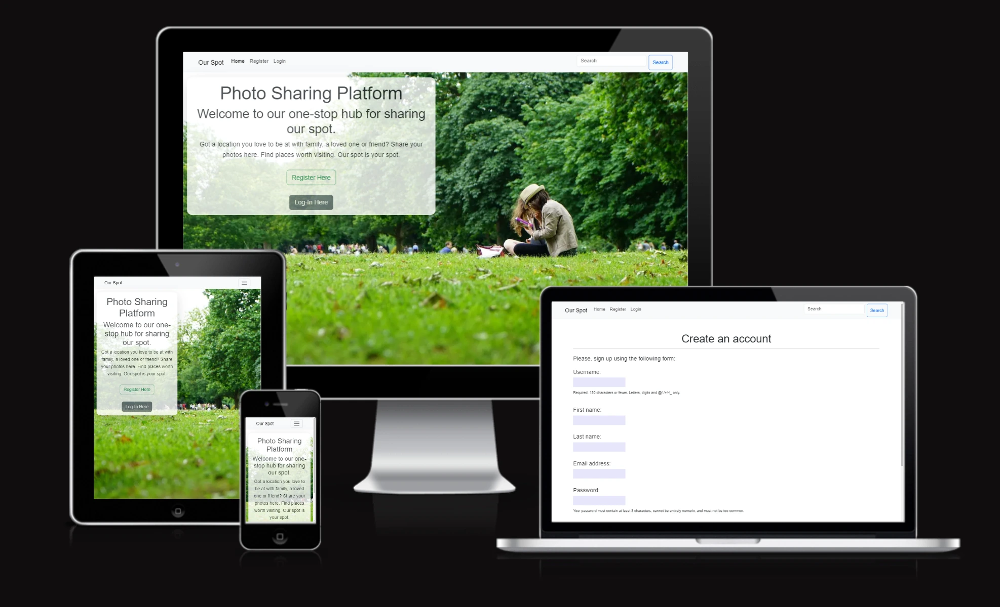

# Share Your Spot Photo Sharing Platform

## Table of Content

 
Developer: Diane Corriette - [GitHub](https://github.com/todiane) & [Website](https://djangify.up.railway.app/)

Live Demo: https://www.showyourspot.com

A social platform to share images of the places you love, built with Django.

Table of Contents

Features

Tech Stack

Prerequisites

Installation

Configuration

Usage

Testing

Deployment

Contributing

License

Contact

Features

User registration and authentication

User profiles with avatar and bio

Upload and share photos of your favorite spots

Geolocation tagging and map integration

Browse spots by location, tags, or popularity

Comment, like, and follow functionality

Blog posts section for sharing travel stories

Tech Stack

Backend: Django

Frontend: Django Templates, HTML5, CSS3, JavaScript

Database: SQLite (development), PostgreSQL (production recommended)

Storage: Local file system or AWS S3

Web Server: Gunicorn / Passenger WSGI

Dependencies: See requirements.txt

Prerequisites

Python 3.8+

pip

virtualenv (optional but recommended)

Installation

Clone the repo

git clone https://github.com/djangify/our-spot.git
cd our-spot

Create a virtual environment

python -m venv venv
source venv/bin/activate  # On Windows: venv\\Scripts\\activate

Install dependencies

pip install -r requirements.txt

Apply migrations

python manage.py migrate

Create a superuser

python manage.py createsuperuser

Collect static files

python manage.py collectstatic

Run the development server

python manage.py runserver

Configuration

Copy .env.example to .env and update the following environment variables:

SECRET_KEY=your_secret_key
DEBUG=True
ALLOWED_HOSTS=localhost,127.0.0.1
DATABASE_URL=sqlite:///db.sqlite3  # or your production DB URL
# S3 Storage (optional)
AWS_ACCESS_KEY_ID=
AWS_SECRET_ACCESS_KEY=
AWS_STORAGE_BUCKET_NAME=

Usage

Navigate to http://localhost:8000 in your browser.

Register a new account or log in.

Upload spot photos, browse other users` spots, comment and like.

Access the admin at /admin/ to manage content.

Testing

Run tests with:

pytest

Deployment

This project can be deployed on platforms like Heroku, Railway, or AWS. Ensure you set up environment variables and configure a production-level database and static/media storage.

Contributing

Contributions are welcome! Please:

Fork the project

Create your feature branch (git checkout -b feature/YourFeature)

Commit your changes (git commit -m 'Add YourFeature')

Push to the branch (git push origin feature/YourFeature)

Open a Pull Request

License

This project is licensed under the MIT License - see the LICENSE file for details.

Contact

Website: https://www.showyourspot.com

Repo: https://github.com/djangify/our-spot

Developer: Diane Corriette (@todiane)

(<a href="#table-of-content">back to top</a>)
