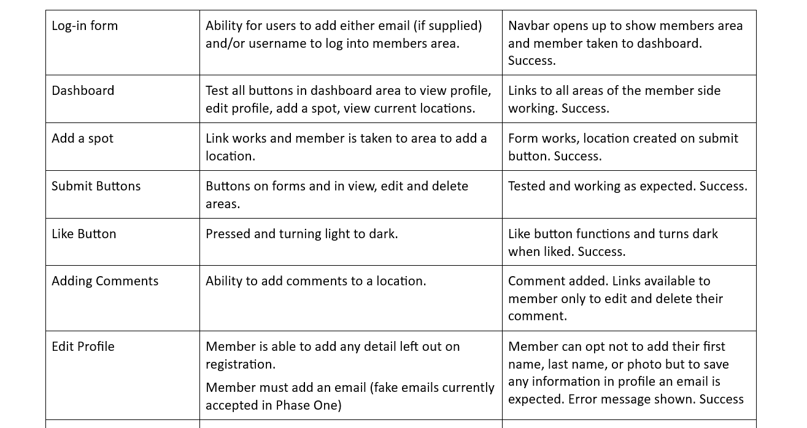

# Our Spot Photo Sharing Platform

## Testing Page

Live Site is [available HERE](https://ourspot-d2a3c52401dc.herokuapp.com/)

[Project Repository](https://github.com/todiane/our-spot)

[GitHub Project Table](https://github.com/users/todiane/projects/8/views/1?layout=board)

Flake8 is installed and being used to ensure [PEP8 python standard](https://peps.python.org/pep-0008/#introduction)

Developer: Diane Corriette - [GitHub](https://github.com/todiane) & [LinkedIn](https://www.linkedin.com/in/todianedev/)

***Browser Testing***

Layout: The layout and appearance of the site has been tested for consistency throughout browsers. Browers tested include the main four:

- Chrome
- Firefox
- Safari
- Microsoft Edge

Website looks and functions as intended on all browsers.

***Search Testing***

Search bar in navagation has been tested. Searched using countries e.g. Scotland, local areas e.g. Staffordshire. Searches using words such as "swim" or "walk" also show results. More specific search targetting is needed to improve this facility. If no locations are found when using the search facility nothing is shown. To improve user experience a message stating that nothing has been found needs to be included. This is will added in Stage Two.

***Functionality:***

Testing complete functionality of the site. This includes:

  

 ## Python 

 Reformatting was performed on the python files using the code formatter [Black](https://github.com/psf/black)
 and the Code Institute [Python Linter](https://pep8ci.herokuapp.com/) was used to highlight coding errors.

 

## CSS and JavaScript Tests

 [CSS validation service](https://jigsaw.w3.org/css-validator/) - css code validated

   

 [JSHint](https://jshint.com/) - no errors shown

   

 ## HTML Testing

 There were a line of code that has been left over the 79 characters usually expected because errors happened when they were changed.
 
 List.html page - line 16 - linter highlights 6 problems. When attempts were made to make changes to this line, including making it shorter, the images disappeared so it was left in place. CSS was included to avoid conflict with images on the location page using the same Bootstrap class.

 All html pages were tested using the [W3C Markup Validation](https://validator.w3.org/ ) Service.

## Bugs

***Known Bugs***

- Users sometimes taken to the top of the page when they like, edit or delete a comment rather than staying in the location of the like/comment area.

- The 'report photo' and 'report profile' modal has stopped working but is not an essential component of project 4 or Stage One so will be fixed during Stage Two.

- When a user edits their location the date and time are also edited to the current date and time, rather than staying at the original date and time.

- In the profile area an email is required to save any profile updates. Members can register without email but cannot update their profile without one so initially made up emails have been used.

## Performance and accessibility

The Lighthouse Chrome DevTools Performance test showed a 92% performance and 100% accessibility score. 

  

 ***Favicon***

A favicon has been added and shows up in the browser

  

 ***Robots.txt***

 A robots.txt file has been added to allow search engines to crawl the network.
 

## Restrospective

Overall, I am happy with the number of tests I performed to ensure the first stage of this project - which as stated is a minimum viable product - is user-centered and working well. Being a user has helped me see what is needed from a members perspective and having a few actual members looking at the platform and gaining their feedback when it comes to testing has also been invaluable.

I need to improve my knowledge of testing aspect of projects outside of manual testing and in my next project I hope to include more test driven data from the start. I also need to improve my knowledge of creating tests using the Django test.py files along with my debugging skills.
